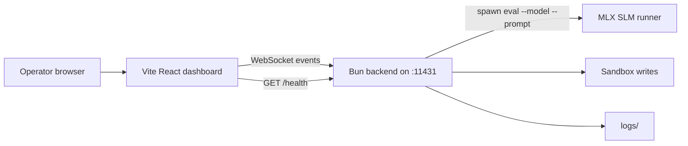

# Bonsai Harness

Bonsai Harness is a local beta orchestration surface for spawning MLX/SLM workers, streaming harness events over WebSocket, and writing controlled sandbox artifacts under `/Volumes/SanDisk1Tb/bonsai-harness/sandbox`.

## Beta status

Current release target: `0.1.0-beta.3`.

This is beta-ready for local operator testing, not production-ready for unattended multi-user service. The beta cutover establishes:

- Claimed backend/WebSocket port `11431` in `/Volumes/SanDisk1Tb/SSOT/port-registry.json`.
- Optional frontend dev/preview port `11432` in the same registry.
- Backend health, smoke-mode spawning, and bounded frontend log rendering.
- LaunchAgent resource limits for file descriptors.
- CI, Docker, OpenAPI, and operator documentation surfaces.

## Architecture



## Ports

| Surface | Port | Registry status |
| --- | ---: | --- |
| Backend HTTP/WebSocket | `11431` | Claimed for `bonsai-harness` |
| Frontend Vite dev/preview | `11432` | Claimed for `bonsai-harness-frontend` |

Do not use port `3000`; it is forbidden by local governance.

## Local setup

Required tooling:

- Bun 1.3+
- macOS launchd for LaunchAgent operation
- Local model runner at `HARNESS_RUNNER_BINARY` plus `HARNESS_RUNNER_ARGS_TEMPLATE`, or `/bin/echo` for smoke-mode verification

Install dependencies:

```bash
cd backend && bun install --frozen-lockfile
cd ../frontend && bun install --frozen-lockfile
```

Run backend in smoke mode:

```bash
cd /Volumes/SanDisk1Tb/bonsai-harness
HARNESS_RUNNER_BINARY=/bin/echo HARNESS_RUNNER_ARGS_TEMPLATE='{{runtimeKind}} --model {{modelId}} --prompt {{prompt}}' PORT=11431 bun run backend:dev
```

Run frontend:

```bash
cd /Volumes/SanDisk1Tb/bonsai-harness
VITE_HARNESS_BACKEND_URL=http://localhost:11431 bun run frontend:dev
```

Open `http://localhost:11432`.

## Verification

Run the beta gate:

```bash
bun run verify:beta
```

Run the smoke scenario against a running smoke backend:

```bash
HARNESS_RUNNER_BINARY=/bin/echo HARNESS_RUNNER_ARGS_TEMPLATE='{{runtimeKind}} --model {{modelId}} --prompt {{prompt}}' PORT=11431 bun run backend:dev
HARNESS_SMOKE_URL=http://localhost:11431 bun run smoke
```

Expected smoke evidence includes a healthy `/health` JSON payload and WebSocket events for `Connected`, `Spawned Smoke-01`, and an inference line produced by `/bin/echo`.

## LaunchAgent

The project LaunchAgent template is `launchd/com.legacyai.bonsaiharness.plist`.

Install or refresh manually:

```bash
cp launchd/com.legacyai.bonsaiharness.plist ~/Library/LaunchAgents/com.legacyai.bonsaiharness.plist
launchctl bootout gui/$(id -u) ~/Library/LaunchAgents/com.legacyai.bonsaiharness.plist 2>/dev/null || true
launchctl bootstrap gui/$(id -u) ~/Library/LaunchAgents/com.legacyai.bonsaiharness.plist
launchctl print gui/$(id -u)/com.legacyai.bonsaiharness
```

The plist sets `PORT=11431`, `HARNESS_SANDBOX_ROOT=/Volumes/SanDisk1Tb/bonsai-harness/sandbox`, `HARNESS_RUNTIME_KIND=local-command`, and a launchd `SoftResourceLimits.NumberOfFiles` value of `65536`.
Launchd stdio paths use `/tmp/bonsai-harness.launchd.*.log` to avoid macOS external-volume `xpcproxy` denials; the startup script redirects backend runtime output into `logs/harness.log` and `logs/harness.error.log` after the process starts.
If `launchctl print` shows repeated exits and macOS unified logs show `System Policy: bun deny file-read-data /Volumes/SanDisk1Tb/bonsai-harness`, grant the terminal/launchd host Full Disk Access for the external volume or run the backend manually with the smoke command above. The beta template is syntactically valid, but macOS privacy policy can still block background Bun reads from external drives.

## API documentation

OpenAPI contract: `docs/api/openapi.yaml`.

The backend exposes:

- `GET /health`
- `POST /mcp/local-fs`
- WebSocket upgrade for client messages (`spawn_agent`, `write_sandbox`) and harness events.

## Docker beta path

Build and run backend only:

```bash
docker build -t bonsai-harness:beta .
docker run --rm -p 11431:11431 bonsai-harness:beta
```

Run backend plus frontend dev surface:

```bash
docker compose up --build
```

The Docker default uses `HARNESS_RUNNER_BINARY=/bin/echo` and a smoke-safe `HARNESS_RUNNER_ARGS_TEMPLATE` so smoke spawning works without mounting a local model toolchain. Override `HARNESS_RUNNER_BINARY`, `HARNESS_RUNNER_ARGS_TEMPLATE`, and cache paths for real local inference, or set `HARNESS_RUNTIME_KIND=openai-compatible` with server-side `HARNESS_API_*` values for API-backed models.
